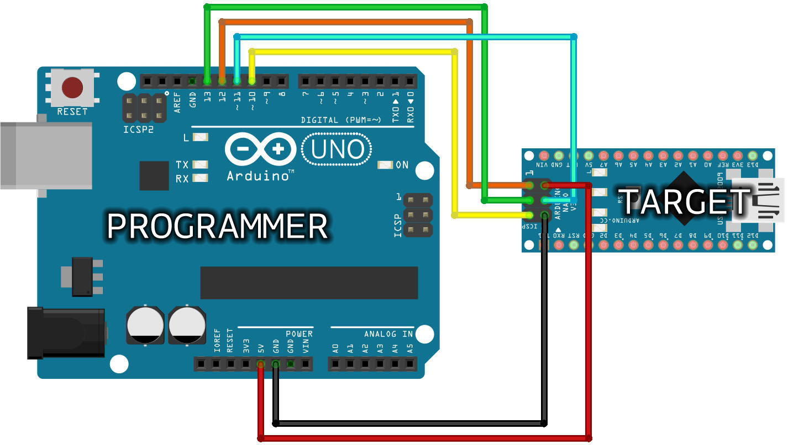
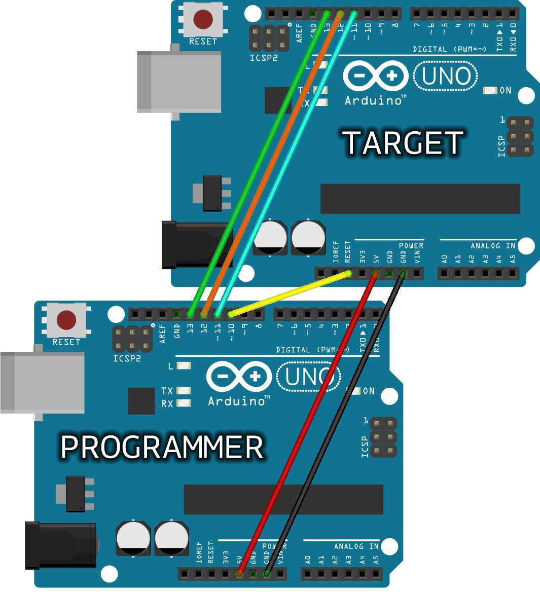

# Arduino-ISP

This submodule is for using an Arduino Uno to program another Arduino via the ISP port.
This is useful for instance if the usb port is blocked on a device, but it is most useful if you need to burn a bootloader to a new board.

You can find the online instructions for the example built into the Arduino IDE on [Arduino's website](https://docs.arduino.cc/built-in-examples/arduino-isp/ArduinoISP).
Below is a transcript of the instructions.

## 1. Upload The ISP Sketch To The Programmer

Before wiring anything, upload the ```Arduino-ISP.ino``` sketch to your programmer board.
This file is the same as the one in the Arduino IDE examples.
Make sure to use the Port and Model of the programmer board for this step.

## 2. Connect The Programmer To The Target Board

See the diagram below that matches your use case. You should use an Uno board as the programmer, but you can program any kind of board.
For boards other than Nano or Uno, see the official instructions so you don't brick your board.




## 3. Upload Code Or Bootloader

Once connected, you can upload to the target board as if it were connected directly to your computer.
Set the programmer to ```Arduino as ISP``` and the port and board type to the target board.
You can also choose ```Burn bootloader```, which may be necessary with new or mis-configured boards.
