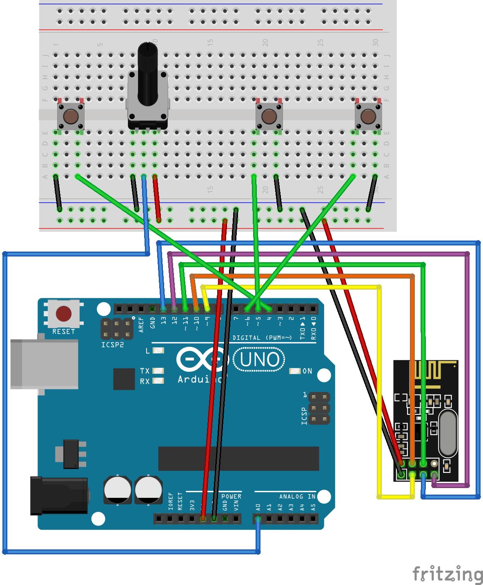
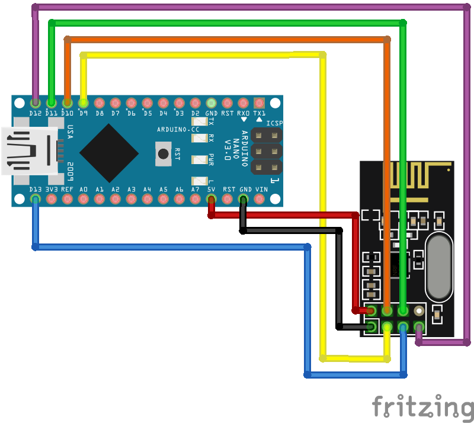

# Hardware-Tests/nRF24L01

The ```Transceiver``` program has a built-in debug mode which can be used for testing. Follow the instructions below to use this mode to verify that your transmitter and receiver are working correctly.

## 1. Test The Transmitter

Use the diagram in ```nRF24L01-TX-Test.png``` (embeded below) to create your transmitter.
Then deploy the Transceiver code with the ```DEBUG_MODE``` un-commented and the ```IS_RECEIVER``` commented.
This puts the board in transmitter debug mode.



You can connect via USB to verify that the data is being sent correctly.
Upon boot the radio will print its debug information.
Each second after that a copy of the data being transmitted is printed as ```throttle yaw pitch roll AUX1 AUX2```.
A working system should look like this after a few seconds:

```plaintext
SPI Frequency           = 10 Mhz
Channel                 = 120 (~ 2520 MHz)
Model                   = nRF24L01+
RF Data Rate            = 250 KBPS
RF Power Amplifier      = PA_MAX
RF Low Noise Amplifier  = Enabled
CRC Length              = 16 bits
Address Length          = 5 bytes
Static Payload Length   = 6 bytes
Auto Retry Delay        = 1500 microseconds
Auto Retry Attempts     = 15 maximum
Packets lost on
    current channel     = 0
Retry attempts made for
    last transmission   = 0
Multicast               = Disabled
Custom ACK Payload      = Disabled
Dynamic Payloads        = Disabled
Auto Acknowledgment     = Disabled
Primary Mode            = TX
TX address              = 0xe8e8f0f0e1
pipe 0 ( open ) bound   = 0xe8e8f0f0e1
pipe 1 (closed) bound   = 0xc2c2c2c2c2
pipe 2 (closed) bound   = 0xc3
pipe 3 (closed) bound   = 0xc4
pipe 4 (closed) bound   = 0xc5
pipe 5 (closed) bound   = 0xc6
0 127 127 127 0 0
0 127 127 127 0 0
0 127 127 127 0 0
78 152 102 127 0 0
78 152 102 127 0 0
78 152 102 127 0 0
78 127 127 127 0 0
```

## 2. Test the Receiver

Use the diagram in ```nRF24L01-RX-Test.png``` (embeded below) to create the receiver.
Deploy the Transceiver code with ```DEBUG_MODE``` and ```IS_RECEIVER``` un-commented.
This puts the board in receiver debug mode.

NOTE: See #12 in GitHub, there is some sort of hardware bug with using a Arduino Nano with the nRF24 chip.
Code is working correctly; if you do this setup with an UNO it will work.



Upload the transceiver code to the transmitter agin, but this time turn off debug mode.
Then plug the working transmitter into a wall outlet (not to your computer, as it is tedious to have multiple serial monitors open at once).
Connect the serial monitor to the receiver, and you should see the numbers from before on screen.
The radio information should also print, but it will be the receiver radio not the transmitter.
You should get something like this:

```plaintext
SPI Frequency           = 10 Mhz
Channel                 = 120 (~ 2476 MHz)
Model                   = nRF24L01+
RF Data Rate            = 250 KBPS
RF Power Amplifier      = PA_MAX
RF Low Noise Amplifier  = Enabled
CRC Length              = 16 bits
Address Length          = 5 bytes
Static Payload Length   = 6 bytes
Auto Retry Delay        = 1500 microseconds
Auto Retry Attempts     = 15 maximum
Packets lost on
    current channel     = 0
Retry attempts made for
    last transmission   = 0
Multicast               = Disabled
Custom ACK Payload      = Disabled
Dynamic Payloads        = Disabled
Auto Acknowledgment     = Disabled
Primary Mode            = RX
TX address              = 0xe7e7e7e7e7
pipe 0 (closed) bound   = 0xe7e7e7e7e7
pipe 1 ( open ) bound   = 0xe8e8f0f0e1
pipe 2 (closed) bound   = 0xc3
pipe 3 (closed) bound   = 0xc4
pipe 4 (closed) bound   = 0xc5
pipe 5 (closed) bound   = 0xc6
```
